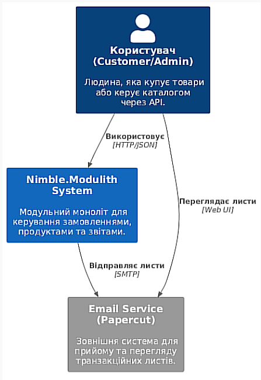
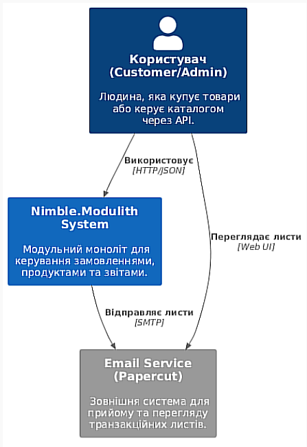
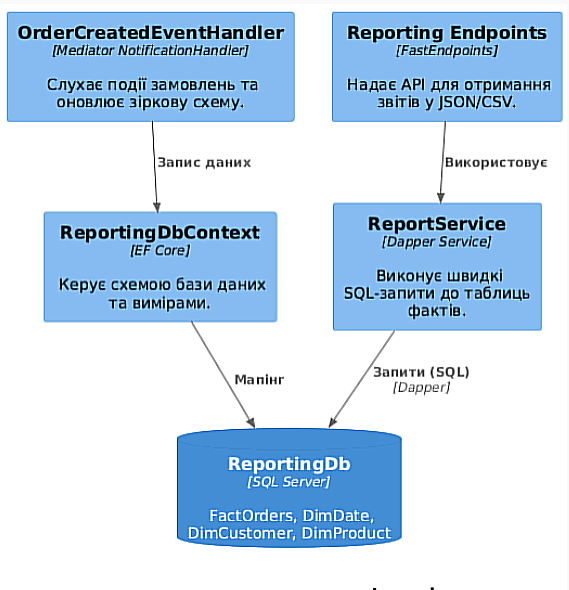

## Опис проекту
Nimble.Modulith - це проект, що демонструє побудову архітектури типу **Modular Monolith** на базі .NET 10. Проект розділений на слабо пов'язані модулі, кожен з яких відповідає за окрему бізнес-функціональність, має власну базу даних та спілкується з іншими модулями через чітко визначені контракти.

## Архітектура та Технології
Проект використовує такий стек технологій та патернів:
- **Framework:** .NET 10
- **Orchestration:** .NET Aspire
- **API:** FastEndpoints
- **Communication:**
    - **Mediator (Source Generated):** Для синхронних запитів між модулями (наприклад отримання ціни продукту в модулі замовлень).
    - **Integration Events:** Для асинхронної взаємодії (наприклад відправка пошти при створенні замовлення).
- **Data:**
    - **EF Core:** Для транзакційних операцій та міграцій.
    - **Dapper:** Для високоефективних аналітичних запитів у модулі звітів.
    - **Star Schema:** Зіркоподібна схема в модулі Reporting для аналітики.

## Структура модулів
1. **Users Module:** Керування користувачами, автентифікація, автоматична генерація паролів та скидання пароля.
2. **Products Module:** Каталог товарів та управління цінами.
3. **Customers Module:** Профілі клієнтів та повний життєвий цикл замовлень.
4. **Email Module:** Фонова відправка транзакційних листів через чергу (Background Service).
5. **Reporting Module:** Збір даних через події та формування звітів (JSON та CSV).

## Інструкція запуску

### Попередні вимоги
- .NET 10 SDK
- Docker Desktop

### Запуск проекту
1. Склонуйте репозиторій, командою:
- git clone https://github.com/Tomjerri1/practicum-2-4.git
2. Перейдіть у корінь проекту, командою:
- cd practicum-2-4
3. Виконайте збірку, командою:
- dotnet build
4. Запустіть проект через Aspire AppHost, командою: 
- dotnet run --project Nimble.Modulith.AppHost/Nimble.Modulith.AppHost.csproj
5. Відкрийте Aspire Dashboard (посилання з'явиться в консолі), де ви знайдете посилання на:
- webfrontend: Swagger UI для тестування API.
- papercut: Веб-інтерфейс для перегляду відправлених листів.
### Тестування
- Створення акаунта: POST /register. увести Email і password.
- Автентифікація: POST /login з даними клієнта для отримання JWT-токену.
- Створення продукту: POST /products (потрібна роль Admin, її можна отримати зайшовши в /users/reset-password і увівши id який дало при реєстрації нового користувача і увести у "RoleName" роль "Admin").
- Створення клієнта: POST /customers. увести всі дані які просить.
- Замовлення: POST /orders від імені клієнта.
- Підтвердження: POST /orders/{id}/confirm. Це заблокує замовлення, надішле чек на пошту та передасть дані в модуль звітів.
- Звіти: Перевірте GET /reports/orders для перегляду аналітики.
### Архітектурні рішення
- Повна ізоляція: Кожен модуль має свій DbContext та власну схему в базі даних (Users, Products, Customers, Reporting).
- Outbox Pattern (спрощений): Листи не відправляються миттєво, а стають у чергу ChannelQueueService, яку обробляє фоновий воркер, що запобігає затримкам API при проблемах з поштовим сервером.
- Reporting Separation: Модуль звітів не робить запити до основних баз. Він будує власну базу фактів та вимірів на основі подій, що дозволяє будувати складні звіти без впливу на продуктивність системи замовлень.

### Структура рішень
1. У модульному моноліті зроблено розділення на Implementation та Contracts(інтерфейси/події).
- Module.Contracts: містить лише DTO, команди, події та інтерфейси. Це те, що інші модулі можуть бачити.
- Module: містить логіку, БД та ендпоінти. Це закрита частина модуля.
2. Моніторинг та спостережливість
- OpenTelemetry: збір логів, трасувань та метрик інтегрований через ServiceDefaults.
- Aspire Dashboard: дозволяє в реальному часі бачити стан усіх баз даних та трафік між модулями.
3. Деталі схеми модуля reporting
- Dimensions: DimDate (2025-2026 роки), DimCustomer, DimProduct.
- Facts: FactOrders, що зберігає кількісні показники для аналітики.

